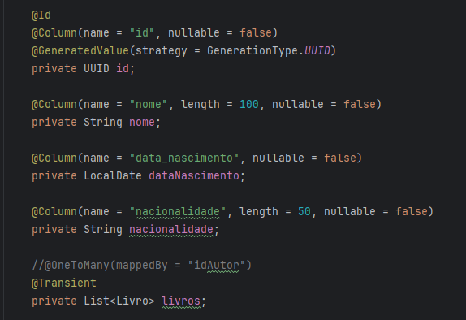
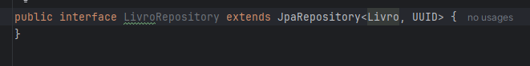

# Spring Data JPA
 

  - [Sobre](#Sobre)
  - [Inicio](#Inicio)
  - [Banco de dados](#Banco-de-Dados)
  - [Mapeando com JPA](#Mapeando-Com-JPA)
  - [Classes e Metodos Teste](#Classe-e-Metodos-Teste)
  - [Tecnologias Usadas](#Tecnologias-Usadas)

## Sobre

 Um programa para exemplificar e estudar o acesso a dados com Spring JPA utilizando docker para rodar uma imagem de um banco de dados postgresSQL. 

## Inicio

Crei a base do meu projeto no site [spring initializr](https://start.spring.io/), escolhi a versão, linguas, projeto e depenpêndencias: 

Antes de começar a se aprofundar em JPA e configurar o banco de dados, como a ideia desse projeto é usar o docker, precisamos criar e subir imagens. Antes de criar as imagemns de aplicações do projeto, preciso criar um network para que os contenier se conectem entre sim. 

No cmd realizei esse comando: 

Depois criei uma imagem do postgresSQL apontando para o meu network criado anteriormente:

e por fim, a imagem do pgadmin4 também apontando para o meu network: 

Configurando o pgadmin4: 

Associando ao postgresSQL: 

## Banco de Dados

Com o banco de dados criado, precisamos gerar as tabelas, no projeto vamos simular a publicação de um livro, tendo um autor por trás.

Criação da tabela autor: 

criação da tabela livro: 

No próximo passo agora no spring, precisamos configurar o driver do banco de dados para o spring iniciar.

Substitui o arquivo propeties por yamal, e ficou assim:

Com isso, o gerenciamento do spring é capaz de rodar o programa com o driver padrão, porém a ideia é se aprofundar em spring, então vamos criar e configurar o drive na mão:

Criando uma classe com a anotação @Configuration para configurar nossos beans:

A classe com a anotação @Configuration, para ser gerenciada pelo spring, os campos com a anotação @value representa variveias que servem para armazenar dados da configuração do datasource.

Segue o bean da classe, com a configuração do driver do banco de dados:

Uma configuração padrão, a classe Hiraki já é utilizada pelo próprio spring como o padrão.

## Mapeando com JPA

### Entidades

Criando e mapeando as minha esntidadeas, primeiro a classe autor, já que existe uma coluna na entidade livro que depende do autor:

Membros da classe Autor: 

Classe Livro agora: 

Membros da classe livro:

Primeiramente precisamos anotar a classe com o @Entity, ela serve para dizer que a classe é uma entidade, e o spring juntamente com jpa, entenderá que a classe representará uma tabela e deverá ser persistida no banco de dados, e seus atributos serão mapeados para colunas da tabela correspondente. A Anotação @Table é usado para representar a qual tabela do banco de dados a classe de entidade pertence, ela não é obrigatória, tem o parametro nome que serve para personalizar o nome da tabela, e schema, para definir o esquema da tabela, Se você não fornecer o esquema, ele usa o esquema padrão(No caso do postgresSQL é public). A anotação @Data faz parte da biblioteca Lombok, ela serve para gerar automaticamente metodos úteis em tempo de execução da classe, como: toString, getteres e setteres, construtores padrão e com argumentos, hashcode, etc. 

Nos membros, primeiramente, precisamos fornecer qual é a variavel id da minha entidade, ela receberá a anotação @ID, ela serve para marcar que esse é a chave primaria da entidade, e mais pra frente será importante. A anotação @Column serve para configurar as propriedades de mapeamento de uma coluna, você personalizar diversos aspectos do mapeamento entre os atributos da entidade e as colunas do banco de dados, como nome da coluna, tipo de dados, se a coluna pode ser nula ou não, entre outros(Como as colunas ja foram criadas com o comando SQL não necessita personalizar).

Existe um campo da classe autor que está marcada com a anotação @Transient, ela serve para marca um atributo que não deve ser mapeado para uma coluna no banco de dados, por agora, isso será importe para realizar teste individuais em metodos mais pra frente. Nesse campo também existe a anotação @OneToMany, é usada para mapear um relacionamento de um para muitos entre duas entidades. Ou seja, ela indica que uma instância de uma entidade pode estar associada a várias instâncias de outra entidade. Assim como na classe livro existe um membro que recebe a anotação @ManyToOne, é usada para mapear um relacionamento de muitos para um entre duas entidades. Ela indica que várias instâncias de uma entidade estão associadas a uma única instância de outra entidade, e também recebe a anotação @JoinColumn é usada para especificar a coluna que será utilizada para realizar o mapeamento entre duas entidades em um relacionamento. Esses aspectos serão detalhados mais a frente no programa

Existem um campo na classe livro que é marcado como Enum, então foi criado um enum:

Ele também recebe a anotação @Enumerated, é usada para especificar como um campo do tipo enum (enumerado) deve ser armazenado no banco de dados(ela casa com o comando SQL na criação da tabela livro coluna genero o constraint que só pode ser recebidos tal valores informados), tem parametros como EnumType.ORDINAL e EnumType.STRING, o EnumType.STRING que é usado nesse caso, Armazena o valor do enum como o nome da constante (como uma string). Ou seja, o valor armazenado no banco será o nome do enum, o EnumType.ORDINAL Armazena o valor do enum como o índice ordinal (posição) do valor no enum. Por exemplo, se o valor FANTASIA(No Enum criado) é o primeiro valor do enum, ele será armazenado como 0 no banco de dados.

### Repository

Na camada repositorio, no jpa, normalmente é usado interface como base, ela serve para herda outra interface presente no [starter data jpa](https://mvnrepository.com/artifact/org.springframework.boot/spring-boot-starter-data-jpa), essa interface é um conjunto de outras interfaces e anotações, que herda metodos e funcionalidades (Como exemplo os metodos crud (já com a lógica) para realizar operações no banco de dados), essas interface depende de dois tipos genéricos que serão importate para realizar operações futuras, no caso ela quer saber qual é classe que será a entidade do meu programa e o tipo da minha chave primaria, no caso as classes são Autor e Livro, e o tipo da chave primaria é a classe que carrega anotação @ID, no caso UUID.

Autor repository:

Livro repository:

## Classe e Metodos Teste

No Spring, por padrão, quando o projeto é criado já é inserido a dependencia [starter test](https://mvnrepository.com/artifact/org.springframework.boot/spring-boot-starter-test), básicamente ela serve para realizar teste através de metodos com nossas entidades e repositorios mocados.

Como boa prática é indicado criar pacote para separar a lógica do teste para cada entidade e repositorio:

## Tecnologias Usadas

[Java](https://www.java.com/pt-BR/) / [Spring](https://spring.io/projects/spring-boot) / [Docker](https://www.docker.com/) / [PostgresSQL](https://www.postgresql.org/) / [Pgadmin4](https://www.pgadmin.org/download/pgadmin-4-windows/)
